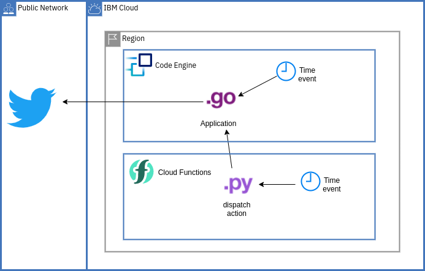

# Sample dispatch action in IBM Cloud Functions / OpenWhisk

The file [dispatch.py](dispatch.py) implements a small dispatcher to demonstrate cron-like scheduling. It checks the passed in arguments for a known job ID. If found it sets up the request, calls out to the provided URI and passes the provided payload. It returns with details about the processed request.

It uses the deployed [Twitter Bot](https://github.com/data-henrik/twitterBot/tree/feed) as target. The request and its payload cause a new Twitter status update (tweet) to be generated.



### IBM Cloud Functions setup

1. Optionally create, then target a functions namespace:
   ```
   ibmcloud fn namespace target bot
   ```
2. Create / update the new action:
   ```
   ibmcloud fn action update dispatch dispatch.py --kind python:default
   ```
3. Create a new trigger based on the alarm package.
   ```
   ibmcloud fn trigger create cf_tweety --feed /whisk.system/alarms/alarm --param cron "22 10 * * *" 
   --param trigger_payload '{"CE_TWEET": { "url":"https://twitterbot.xxxxxxxxxx.us-south.codeengine.appdomain.cloud/tweet", "payload":{"secret_key":"SET_YOUR_SECRET","tweet_string2":"Triggered by #OpenWhisk and dispatched in #Python on #IBMCloud" }}}'
   ```
4. Associate trigger and action by rule:
   ```
   ibmcloud fn rule create myTweetRule cf_tweety dispatch
   ```

### Local Testing

Once the action is created / updated, you can invoke it locally like this. Adapt [params.json.sample](params.json.sample) to your needs.

```
ibmcloud fn action invoke dispatch -r --param-file params.json
```